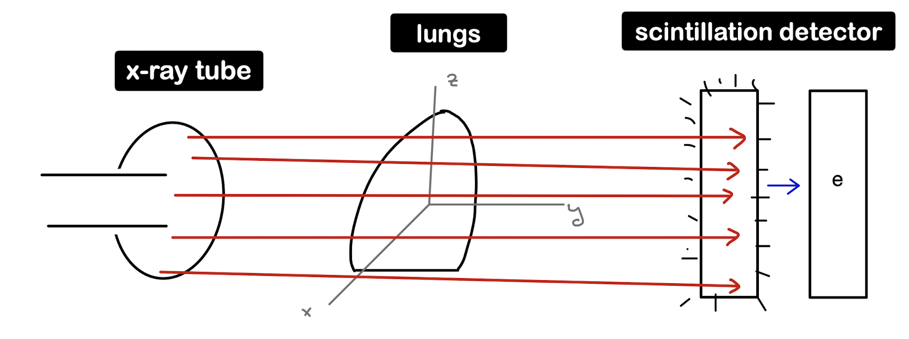
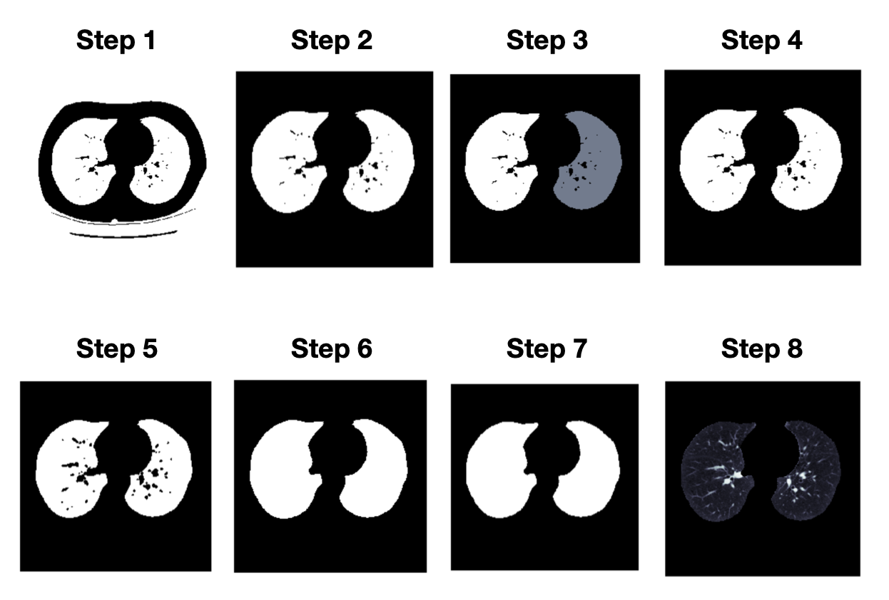

```{r setup, include=FALSE}
knitr::opts_chunk$set(echo = TRUE, dev = "png")
```


# Index
1. Introduction to radiomics
2. Image display
3. Radiomic features
4. Segmentation

    4.1. Segmentation with lungct
    
    4.2. Segmentation with Python (I)
    
    4.3. Segmentation with Python (II)

    4.4. Segmentation with lungmask

5. Radiomic features

    5.1. Radiomic features with RIA
    
    5.2.  Radiomic features with pyradiomics

6. RaDAr object

    6.1. Example creating RaDAr object

    6.2. RaDAr object with L1

7. Data analysis 
    
    7.1. Clinical data

    7.2. Principal Component Analysis (PCA)

    7.3. Canonical correlation analysis (CCA)

    7.4 COPD vs controls classification

    7.5 Classification COPD types


<br>
 
 
## 1. Introduction to radiomics
Medical images are essential for studying diseases. For example, to examine how a patient's tumor evolves, we perform multiple scans over time. Interpreting how the tumor has changed by looking at the images is not an easy task, and different doctors may predict different outcomes. This is where computers become very useful. Thanks to artificial intelligence techniques, we can show computers different medical images over time of a patient with a tumor, and they can identify features of these images to make predictions. They can help decide whether a treatment for a tumor is working or not, decide which alternative treatment to use, and much more, without having to wait for the tumor to get worse. 

In the last decades, several areas of human activities have experienced an increase in digitization. In the case of medicine, a significant amount of information generated during clinical routine has been digitized. With this digital increase, new and better software has been developed to analyze the data. Thanks to research in Artificial Intelligence, these methods have become very powerful and available to any user, allowing doctors to use them on a daily basis. 

As the amount of data increases, different Artificial Intelligence techniques - mainly Machine Learning and Deep Learning - are of high utility to deal with this large amount of data, an area known as "Big Data". In simple terms, Big Data refers to sets of data whose size, complexity and speed of growth make it difficult to analyze using traditional tools.

Radiomics is a field of medical study whose purpose consists of extracting a large volume of features from medical images using data characterization algorithms. These features are known as radiomic features and can help to discover tumor patterns that are difficult for the human eye to analyze. 
Radiomics is a relatively new scientific filed. The first radiomics studies appeared in PubMed as recently as 2011.

It is believed that, in the end, radiomics will use specific treatments for each patient, will help doctors select the most appropriate treatment for each patient, and will be able to change treatments quickly if they do not work.

Some of the difficulties when performing radiomics research is that high quality images, with adequate size and complete datasets are needed. Different training and validation datasets are also necessary, to check if our algorithm works correctly. Another difficulty is class imbalance (classification problem where the number of observations per class is not equally distributed) and overfitting (when a statistical model exactly fits its training data). The main clinical applications of radiomics are radiogenomics and clinical outcome prediction.

##### **Process of radiomics**
Now we will briefly explain the process of radiomics.

1. <u>Obtain image</u>: first, we obtain a medical image from a scanner (it can be obtained from multiple modalities: magnetic resonance imaging (MRI), computed tomography (CT), positron-emission-tomography (PET)...).
2. <u>Image segmentation</u>: this means dividing the image into multiple segments, in other words, delineating the areas of interest in the image in terms of pixels or voxels. This step can be done manually, semi-automatically or fully automatically.
3. <u>Feature extraction</u>: after image segmentation, we can extract the features and classify them.
4. Finally, we use <u>databases</u> to share our data. 

##### **DICOM images**
In this project, we will study images obtained from scans of the lungs. The images we will obtain from the scans are DICOM images. DICOM (Digital Imaging and Communications in Medicine) is the standard for the communication and management of medical imaging information and related data. It is used worldwide to store, exchange, and transmit medical images. It defines the formats for medical images that can be exchanged with the data and quality necessary for clinical use. DICOM incorporates standards for imaging modalities such as radiography, ultrasonography, computed tomography (CT), magnetic resonance imaging (MRI), and radiation therapy. The most common applications of this standard are the display, storage, printing, and transmission of images.

##### **Radiomic techniques**
To obtain the features, we can use multiple techniques. Radiomic techniques can be divided into four categories: intensity-based metrics, texture-based analysis, shape-based measures, and transform-based metrics. We will briefly discuss these techniques now.

- <u>Intensity-based metrics</u> refers to statistics that are calculated from pixel values (or volumetric pixels called voxels). Additional information that can be obtained from analyzing the relationship between the voxels it is not considered. To compute the statistics, we select a region and extract the voxel values. They can be analyzed with histogram analysis. To quantify different aspects of the distribution we use average and variation, shape, and diversity.

- <u>Texture-based analysis</u> refers to the analysis of image patterns, such as intensity, shape, or colors. Mathematical formulas based on the spatial relationship of voxels are used to quantify these concepts.

- <u>Shape-based measures</u> refer to the study of different components of a structure. They can be divided into 1D metrics (measurement of the distance between two points. They are used to describe the magnitude of an abnormality), 2D metrics (calculated on cross-sectional planes and are used to calculate different parameters that are based on areas) and 3D metrics (attempt to enumerate different aspects of volumetric shape).

- <u>Transform-based metrics</u> refers to the transformation of images from spatial coordinates to what is called a frequency domain, without losing any information.

##### **Radiomic features**
We can obtain multiple types of features from images. Qualitative features are used to describe lesions, and quantitative features are extracted from images using computer programs that apply mathematical algorithms. Now, we will focus on quantitative features, which can be divided into different subgroups.

- <u>Shape features</u> describe the shape of the traced region of interest and its geometric properties like volume, maximum diameter along different orthogonal directions, maximum surface, tumor compactness, etc. 

- <u>First-order statistics</u> features describe the distribution of individual voxel values without taking into account spatial relationships. Some properties we obtain are the mean, median, maximum, minimum values of the voxel intensities on the image, skewness, kurtosis, etc.

- <u>Second-order statistics</u> features include the textural features. They are obtained computing the statistical relationships between neighboring voxels.

- <u>Higher-order statistics</u> features are obtained by statistical methods after applying filters or mathematical transforms to the images. Some examples are fractal analysis, Minkowski functionals or Laplacian transforms of Gaussian-filtered images.


<br>
 
 
## 2. Image display

In this section we will display a few images with different extensions. But first of all, we will explain how we obtain the images.

We will be working with images that look like this:

```{r, echo=FALSE, warning=FALSE, message=FALSE, out.width = "200px", out.height = "300px"}
library(oro.dicom)
library(RIA)
image_example <- readDICOMFile("/Users/andrealetaalfonso/Desktop/TFG/images/Kaggle/ID00007637202177411956430/11.dcm")
image(t(image_example$img), col=grey(0:64/64), axes=FALSE, xlab="", ylab="")
```

To obtain these images, we emit x-rays through an x-ray tube. The rays pass through the lungs and reach a detector. Depending on the tissue it passes through, it absorbs more or less x-rays. The scanner uses the different levels of absorption to create the image.
To make the images, several slices of the lung are made (horizontal slices), if we combine these slices, we can obtain the image of the lung in 3 dimensions.

```{r , echo=FALSE, out.width="35%", out.height="40%", fig.align="center"}

```


##### **DICOM (.dcm) images**
The R package *oro.dicom* is a collection of input/output functions for medical imaging data that conform to the Digital Imaging and Communications in Medicine (DICOM) standard. The R package *RIA* is another package that was developed to facilitate radiomic analysis of medical images. 


Now we will display 2 images from the same patient (that is three slices of a person's lung). To read the images we use the function: *readDICOMFile(path_to_the_image)*.

```{r, out.width = "250px", out.height = "350px"}
image1 <- readDICOMFile("/Users/andrealetaalfonso/Desktop/TFG/images/Kaggle/ID00007637202177411956430/11.dcm")
image(t(image1$img), col=grey(0:64/64), axes=FALSE, xlab="", ylab="")

image2 <- readDICOMFile("/Users/andrealetaalfonso/Desktop/TFG/images/Kaggle/ID00007637202177411956430/12.dcm")
image(t(image2$img), col=grey(0:64/64), axes=FALSE, xlab="", ylab="")
```


<br>


##### **NIFTI (.nii) images**

If we have nifit images, we can view them with thw library *RNifti*. And the function to view the image is: *readNifti(path_to_image)*.

```{r, message=FALSE, out.width="40%"}
library(RNifti)
image <- readNifti("/Users/andrealetaalfonso/Desktop/TFG/DICOMS/rstudio-export/023140000001/023140000001_INSP_STD_L1_ECLIPSE.nii.gz")
view(image, point = c(239, 239, 131))
```

We can also use the library *oro.nifti* and *neurobase*. To view the images use: *neurobase::readnii(path_to_image)*. For example, an image and a mask:

```{r, message=FALSE, out.width="20%"}
library(oro.nifti)
# Image
image2 <- neurobase::readnii("/Users/andrealetaalfonso/Desktop/TFG/DICOMS/rstudio-export/023140000001/023140000001_INSP_STD_L1_ECLIPSE.nii.gz")
image(image2,z=100,plot.type="single")
# Mask
mask <- neurobase::readnii("/Users/andrealetaalfonso/Desktop/TFG/DICOMS/rstudio-export/023140000001/023140000001_INSP_STD_L1_ECLIPSE_mask.nii.gz")
image(mask,z=100,plot.type="single")
```

And to overlay the image and the mask use the function: *oro.nifti::slice_overlay(the_image, the_mask, z)*:

```{r, message=FALSE, out.width="20%"}
oro.nifti::slice_overlay(image2, mask, z=100)
```


<br>
 
 
## 3. Radiomic features

### Radiomic features without masks (RIA)
First we will compute the radiomic features of the images without masks.

To compute the radiomic features of the images using the library RIA, we first need to convert the DICOM images to *RIA_image* class. To do so, we will use the function *load_dicom(path_to_the_file)*. 

If we have other image formats, there exists functions such as *load_nifti()*, *load_nrrd()* and *load_npy()* in RIA to read the images.


<br>


##### **Radiomic features of 1 image**
First, we compute the radiomic features of 1 image without a mask. 

To compute the <u>first-order statistics</u> we use the *first_order()* function.

Some of the metrics computed are the mean, median, energy, entropy, and so on. RIA can calculate 44 different first-order statistics using the *first_order* function.

```{r, results = FALSE, message=FALSE}
DICOM <- RIA::load_dicom(filename="/Users/andrealetaalfonso/Desktop/TFG/images/img/Folder_images/13", skipFirst128=FALSE, DICM=FALSE, boffset = 128)
data <- first_order(RIA_data_in = DICOM) # first order statistics
first_order <- RIA:::list_to_df(data$stat_fo$orig) # list of first order statistics
name_characteristics <- rownames(first_order) # names of the first order statistics
```
```{r, message=FALSE}
library(tidyverse)
```

With RIA we can also compute the <u>Gray level co-occurrence matrix (GLCM)</u> calculations and statistics. GLCMs are second-order statistics.
We would use the function *glcm*.
```{r, eval=FALSE}
DICOM = glcm(RIA_data_in = DICOM, off_right = 1, off_down = 2, off_z = 2)
```

The function glrlm calculates <u>Gray level run length matrix (GLRLM)</u> matrices of 2D and 3D images. GLRLM are higher-order statistics. 
We would use the function *glrlm*.
```{r, eval=FALSE}
DICOM = glrlm(RIA_data_in = DICOM, off_right = 1, off_down = 0, off_z = 1)
```

To compute the <u>GGeometry-based statistics</u>, use the function *geometry*. RIA calculates 9 conventional geometrical parameters and 3 fractal dimensions.
```{r, eval=FALSE}
DICOM = geometry(RIA_data_in = DICOM, use_orig = TRUE, calc_sub = FALSE)
RIA:::list_to_df(DICOM$stat_geometry$orig)
```

And finally, if we want to compute all the radiomic features at once, RIA has the *radiomics_all* to do it. 
```{r, eval=FALSE}
DICOM <- radiomics_all(DICOM, bins_in = c(8, 16, 32), equal_prob = "both")
```


<br>


##### **Radiomic features of 10 images**
Now we will compute the first order characteristics of 10 images (images 10 through 19) from the same patient (different slices) without a mask. We could do the following loop:
```{r, results = FALSE, message=FALSE}
first_order <- c()
res <- c()
first_image <- 10 # first image to study
last_image <- 19 # last image to study
for (i in first_image:last_image) { # for loop through all the images
  path <- file.path("/Users", "andrealetaalfonso", "Desktop","TFG", "images", "img", "Folder_images", i, fsep="/") # path of every image
  DICOM <- RIA::load_dicom(filename=path, skipFirst128=FALSE, DICM=FALSE, boffset = 128) # load dicom image
  DICOM = first_order(RIA_data_in = DICOM, use_type = "single") # compute first order characteristics
  first_order[i] <- RIA:::list_to_df(DICOM$stat_fo$orig)
  res[i-first_image+1] <- first_order[i] # data.frame counts from 1 to 10 (not first_image to last_image)
} 
```

Finally, we combine all the results into a data.frame called 'results'.
```{r}
results <- do.call(cbind.data.frame, res)
colnames(results) <- seq(1, last_image-first_image+1) 
rownames(results) <- name_characteristics
#results:  results in a data.frame
print(as_tibble(results))
```


<br>
 
 
## 4. Segmentation

As we explained in the introduction, segmentation refers to delineating the areas of interest in the image in terms of pixels or voxels, in our case, the lung. Lung segmentation refers to the computer-based process of identifying the boundaries of lungs from surrounding thoracic tissue on the scan images. Once we have the segmented images, we can start our analysis.

Now we will discuss different software to do lung segmentation.


<br>
 
 
### 4.1 Segmentation with lungct

We will use the library in R *lungct*. The lungct R package develops an image processing pipeline for computed tomography (CT) scans of the lungs.

First, we load the libraries needed to do the segmentation. We will use the library *dcm2niir* to convert DCM files to NIFTI.

```{r, message=FALSE}
library(lungct) 
library(dcm2niir) 
library(ANTsRCore)
```

Now we have to convert the data from DCM to NII. NIFTI (Neuroimaging Informatics Technology Initiative) is a data format for the storage of Functional Magnetic Resonance Imaging (fMRI) and other medical images.

```{r, message=FALSE}
res2 <- dcm2niir::dcm2nii(basedir="/Users/andrealetaalfonso/Desktop/TFG/DICOMS/id_1")
checked2 <- check_dcm2nii(res2) # Manipulating the output
```

Next we plot some images.
```{r, out.width = "700px", out.height = "400px"}
image2 <- antsImageRead(checked2)
plot(image2)
```

We create the masks.

```{r, results = FALSE, message=FALSE}
mask2 <- segment_lung(image2)
```

And finally, we plot some of the masks.

```{r, message=FALSE,  out.width = "700px", out.height = "400px"}
plot(mask2$lung_mask)
```


##### **Radiomic features with masks with multiple patients (RIA, lungct)**
Now we will create multiple .txt files with the results of the radiomic features of different patients, using a mask.

The IDs of the patients are the following.

```{r, eval = FALSE}
patient1 <- "ID00007637202177411956430"
patient2 <- "ID00009637202177434476278"
patient3 <- "ID00010637202177584971671"
patient4 <- "ID00011637202177653955184"
patient5 <- "ID00012637202177665765362"
patient6 <- "ID00014637202177757139317"
patient7 <- "ID00015637202177877247924"
patient8 <- "ID00019637202178323708467"
patient9 <- "ID00020637202178344345685"
patient10 <- "ID00023637202179104603099"
vector_patients <- c(patient1, patient2, patient3, patient4, patient5, patient6, patient7, patient8, patient9, patient10) # list of patients ID
```

```{r eval = FALSE, results = FALSE, message=FALSE}
for(patient in vector_patients){
  first_order <- c()
  path <- file.path("/Users", "andrealetaalfonso", "Desktop","TFG", "images", "Kaggle", patient, fsep="/") # path of every image
  number_files <- length(list.files(path)) # number of folders (ie. images) in each patient
  for (i in 1:number_files) { # for loop through all the images
    path <- file.path("/Users", "andrealetaalfonso", "Desktop","TFG", "images", "Kaggle", patient, i, fsep="/") # path of every image
    res <- dcm2niir::dcm2nii(basedir=path) # Convert the data from dcm to nii
    checked <- check_dcm2nii(res) # Manipulating the output
    image <- antsImageRead(checked)
    mask <- segment_lung(image) # Lung segmentation
    DICOM <- RIA::load_dicom(filename=path, mask_filename=path, skipFirst128=FALSE, DICM=FALSE, boffset = 128) # load dicom image + mask
    DICOM = first_order(RIA_data_in = DICOM, use_type = "single") # compute first order characteristics
    first_order[i] <- RIA:::list_to_df(DICOM$stat_fo$orig)
  } 
  results <- do.call(cbind.data.frame, first_order)
  colnames(results) <- seq(1, number_files)
  rownames(results) <- name_characteristics
  write.table(results, row.names = TRUE, col.names=NA, file=paste0(patient,".txt"), sep="\t") # table with the results
}
```


<br>
 
 
### 4.2. Segmentation with Python (I)

Code adapted from: https://www.kaggle.com/arnavkj95/candidate-generation-and-luna16-preprocessing

Now we will do the segmentation but instead of using R, we will be using Python.


First we need to import some Python libraries.

```{python, results = FALSE, message=FALSE}
import numpy as np # pip3 install numpy
import pandas as pd # pip3 install pandas
# pip3 install matplotlib
# pip3 install scipy
import skimage # pip3 install scikit-image
import os 
from skimage.morphology import ball, disk, dilation, binary_erosion, remove_small_objects, erosion, closing, reconstruction, binary_closing
from skimage.measure import label,regionprops, perimeter
from skimage.morphology import binary_dilation, binary_opening
from skimage.filters import roberts, sobel
from skimage import measure, feature
from skimage.segmentation import clear_border
from skimage import data
from scipy import ndimage as ndi
import matplotlib.pyplot as plt
from mpl_toolkits.mplot3d.art3d import Poly3DCollection
import dicom # pip3 install dicom
import scipy.misc
import pydicom # pip3 install pydicom
import matplotlib.pyplot as plt
```

Each scan consist in multiple slices. We have all the DICOM images from the scan in one folder. In *path_images* we indicate the path of the folder.

```{python, results = FALSE, message=FALSE}
from subprocess import check_output
path_images = "/Users/andrealetaalfonso/Desktop/TFG/images/Kaggle/ID00184637202242062969203/"
# You can check that everything is loading correctly with: print(check_output(["ls", path_images]).decode("utf8"))
```

To read the images, we will use the function *pydicom.read_file()*. Then we will update the intensity values of -2000 with 0. These pixels are the ones that are located outside the scanner bounds.

```{python, out.width = "400", results = FALSE}
# pip3 install nltk==3.6.2
lung = pydicom.read_file("/Users/andrealetaalfonso/Desktop/TFG/images/Kaggle/ID00184637202242062969203/20.dcm")
slice = lung.pixel_array
plt.axis('off')
slice[slice == -2000] = 0
```

We create a function *file_is_hidden()* to read only .dcm files and not hidden files in the folder that we cannot see in our computers.
```{python, results = FALSE, message=FALSE}
if os.name == 'nt':
    import win32api, win32con
def file_is_hidden(p):
    if os.name== 'nt':
        attribute = win32api.GetFileAttributes(p)
        return attribute & (win32con.FILE_ATTRIBUTE_HIDDEN | win32con.FILE_ATTRIBUTE_SYSTEM)
    else:
        return p.startswith('.') #linux-osx
file_list = [f for f in os.listdir(path_images) if not file_is_hidden(f)] 
```

Now we will read all the images from a folder with a function named *read_ct_scan(folder_name)*.
```{python, results = FALSE, message=FALSE}
def read_ct_scan(folder_name):
  # Read the slices from the dicom file
  slices = [pydicom.read_file(folder_name + filename) for filename in os.listdir(folder_name) if not file_is_hidden(filename)]
  # Sort the dicom slices in their respective order
  slices.sort(key=lambda x: int(x.InstanceNumber))
  # Get the pixel values for all the slices
  slices = np.stack([s.pixel_array for s in slices])
  slices[slices == -2000] = 0
  return slices
  
ct_scan = read_ct_scan(path_images) 
```

Plot some of the images from a folder.
```{python, out.width = "450px"}
def plot_ct_scan(scan):
    f, plots = plt.subplots(int(scan.shape[0] / 20) + 1, 4, figsize=(25, 25))
    for i in range(0, scan.shape[0], 5):
        plots[int(i / 20), int((i % 20) / 5)].axis('off')
        plots[int(i / 20), int((i % 20) / 5)].imshow(scan[i], cmap=plt.cm.gray) 

plot_ct_scan(ct_scan)
plt.show()
```

Now we will do the lung segmentation of 1 image.

```{python, results = FALSE, message=FALSE}
def get_segmented_lungs2(im, plot=False):
    if plot == True:
        f, plots = plt.subplots()
    # Step 1: Convert into a binary image. 
    binary = im < 604
    # Step 2: Remove the blobs connected to the border of the image.
    cleared = clear_border(binary)
    # Step 3: Label the image.
    label_image = label(cleared)
    # Step 4: Keep the labels with 2 largest areas.
    areas = [r.area for r in regionprops(label_image)]
    areas.sort()
    if len(areas) > 2:
        for region in regionprops(label_image):
            if region.area < areas[-2]:
                for coordinates in region.coords:                
                       label_image[coordinates[0], coordinates[1]] = 0
    binary = label_image > 0
    # Step 5: Erosion operation with a disk of radius 2. This operation is seperate the lung nodules attached to the blood vessels.
    selem = disk(2)
    binary = binary_erosion(binary, selem)
    # Step 6: Closure operation with a disk of radius 10. This operation is to keep nodules attached to the lung wall.
    selem = disk(10)
    binary = binary_closing(binary, selem)
    # Step 7: Fill in the small holes inside the binary mask of lungs.
    edges = roberts(binary)
    binary = ndi.binary_fill_holes(edges)
    if plot == True:
        plots.axis('off')
        plots.imshow(binary, cmap=plt.cm.bone) 
    # Step 8: Superimpose the binary mask on the input image.
    get_high_vals = binary == 0
    im[get_high_vals] = 0
    return im
```

Image
```{python,  echo=FALSE, out.width = "150px"}
# pip3 install nltk==3.6.2
lung = pydicom.read_file("/Users/andrealetaalfonso/Desktop/TFG/images/Kaggle/ID00184637202242062969203/20.dcm")
slice = lung.pixel_array
slice[slice == -2000] = 0
plt.imshow(slice, cmap=plt.cm.gray)
plt.show()
```

Mask of the image
```{python, message=FALSE, results = FALSE}
get_segmented_lungs2(ct_scan[20], True)
```
```{python, out.width = "200px"}
plt.show()
```

The steps to obtain the segmentation are the following.

Now we will briefly explain the process of radiomics.

1. First we convert de image into a binary image. This means that every pixel of the image has only one of two possible values. One black and one white.
2. We remove the spots connected to the edge of the image.
3. Create a label.
4. Keep the labels with two largest areas.
5. Seperate the lung nodules attached to the blood vessels.
6. Keep nodules attached to the lung wall.
7. Fill in the small holes inside the binary mask of lungs.
8. Superimpose the binary mask on the input image.


```{r, echo=FALSE, out.width="40%", out.height=="40%", fig.align="center"}

```


We can do the segmentation of all the slices of the scan.
```{python, out.width = "500px"}
def segment_lung_from_ct_scan(ct_scan):
    return np.asarray([get_segmented_lungs2(slice) for slice in ct_scan])
segmented_ct_scan2 = segment_lung_from_ct_scan(ct_scan)
```


<br>


### 4.3. Segmentation with Python (II)
 
Code adapted from: https://www.raddq.com/dicom-processing-segmentation-visualization-in-python/

We will study another way to perform segmentation of lung scans using Python.

As before, first we need to import some Python libraries.

```{python, results = FALSE, message=FALSE}
import numpy as np
import dicom
import os
import matplotlib.pyplot as plt
from glob import glob
from mpl_toolkits.mplot3d.art3d import Poly3DCollection
import scipy.ndimage
from skimage import morphology
from skimage import measure
from skimage.transform import resize
# pip3 install scikit-learn
from sklearn.cluster import KMeans
# pip3 install plotly
from plotly import __version__
from plotly.offline import download_plotlyjs, init_notebook_mode, plot, iplot
from plotly.tools import FigureFactory as FF
from plotly.graph_objs import *
import pydicom
```

Specify the path where the folder with all the images is, and the path where we want our mask images saved.

```{python}
data_path = "/Users/andrealetaalfonso/Desktop/TFG/images/Kaggle/ID00184637202242062969203/"
output_path = working_path = "/Users/andrealetaalfonso/Desktop/TFG/"
```

Read all the DICOM files. To do so, we use glob, which is used to return all file paths that match a specific pattern.
```{python}
g = glob(data_path + '/*.dcm')
```

Print out the first 5 file names to verify we are in the right folder.
```{python}
# print("Total of %d DICOM images.\nFirst 5 filenames:" % len(g))
# print('\n'.join(g[:5]))
```

Now we loop over the image files and store everything into a list.
```{python}
def load_scan(path):
    slices = [pydicom.read_file(path + '/' + s) for s in os.listdir(path) if not file_is_hidden(s)]
    slices.sort(key = lambda x: int(x.InstanceNumber))
    try:
        slice_thickness = np.abs(slices[0].ImagePositionPatient[2] - slices[1].ImagePositionPatient[2])
    except:
        slice_thickness = np.abs(slices[0].SliceLocation - slices[1].SliceLocation)
    for s in slices:
        s.SliceThickness = slice_thickness
    return slices
```

The voxel values in the images are raw. This function converts raw values into Houndsfeld units (a quantitative scale for describing radiodensity).


```{python}
def get_pixels_hu(scans):
    image = np.stack([s.pixel_array for s in scans])
    # Convert to int16 (from sometimes int16), should be possible as values should always be low enough (<32k)
    image = image.astype(np.int16)
    # Set outside-of-scan pixels to 1. The intercept is usually -1024, so air is approximately 0
    image[image == -2000] = 0
    # Convert to Hounsfield units (HU)
    intercept = scans[0].RescaleIntercept
    slope = scans[0].RescaleSlope
    if slope != 1:
        image = slope * image.astype(np.float64)
        image = image.astype(np.int16)
    image += np.int16(intercept)
    return np.array(image, dtype=np.int16)
```

```{python}
id = 0
patient = load_scan(data_path) 
imgs = get_pixels_hu(patient) 
```

Save in .npy format
```{python, eval = FALSE}
np.save(output_path + "fullimages_%d.npy" % (id), imgs)
```

Now we will check if the Houndsfeld Units (HU) are properly scaled and represented. HU are very important because they are standardized across all CT scans. To give a few examples, air is −1000, lung −500, fat −100 to −50, water 0, blood +30 to +70, muscle +10 to +40 and so on.

Let's display an histogram to check HU.

```{python, results = FALSE,  out.width = "300"}
file_used=output_path+"fullimages_%d.npy" % id
imgs_to_process = np.load(file_used).astype(np.float64) 
plt.hist(imgs_to_process.flatten(), bins=50, color='c')
plt.xlabel("Hounsfield Units (HU)")
plt.ylabel("Frequency")
plt.show()
```

With the histogram, we can see that there is a lot of air and water. An abundance of lung, fat, bood and muscle.

We obtain the conclusions that we will need to do preprocessing to study well the lungs only, because there is a lot of air and water. 

Now we display some of the images, we will be skipping every two slices.

```{python, out.width = "400"}
id = 0
imgs_to_process = np.load(output_path+'fullimages_{}.npy'.format(id))

def sample_stack(stack, rows=4, cols=4, start_with=5, show_every=2):
    fig,ax = plt.subplots(rows,cols,figsize=[12,12])
    for i in range(rows*cols):
        ind = start_with + i*show_every
        ax[int(i/rows),int(i % rows)].set_title('slice %d' % ind)
        ax[int(i/rows),int(i % rows)].imshow(stack[ind],cmap='gray')
        ax[int(i/rows),int(i % rows)].axis('off')
    plt.show()

sample_stack(imgs_to_process)
```


We can see a lot of gray that represents air.

Let's see how thick each slice is.
```{python}
print("Slice Thickness: %f" % patient[0].SliceThickness)
print("Pixel Spacing (row, col): (%f, %f) " % (patient[0].PixelSpacing[0], patient[0].PixelSpacing[1]))
```

Now we do resampling. We want that each slice is resampled in 1x1x1 mm pixels and slices, because it will be useful to obtain the 3d image.
```{python, warnings = FALSE}
id = 0
imgs_to_process = np.load(output_path+'fullimages_{}.npy'.format(id))
def resample(image, scan, new_spacing=[1,1,1]):
    # Determine current pixel spacing
    spacing = map(float, ([scan[0].SliceThickness] + list(scan[0].PixelSpacing)))
    spacing = np.array(list(spacing))
    resize_factor = spacing / new_spacing
    new_real_shape = image.shape * resize_factor
    new_shape = np.round(new_real_shape)
    real_resize_factor = new_shape / image.shape
    new_spacing = spacing / real_resize_factor
    image = scipy.ndimage.interpolation.zoom(image, real_resize_factor)
    return image, new_spacing
```

```{python}
print ("Shape before resampling\t", imgs_to_process.shape)
imgs_after_resamp, spacing = resample(imgs_to_process, patient, [1,1,1])
print ("Shape after resampling\t", imgs_after_resamp.shape)
```


**3D Plotting**

```{python, eval = FALSE}
def make_mesh(image, threshold=-300, step_size=1):
    p = image.transpose(2,1,0)
    verts, faces, norm, val = measure.marching_cubes(p, threshold, step_size=step_size, allow_degenerate=True) 
    return verts, faces
```

```{python, eval = FALSE}
def plt_3d(verts, faces):
    x,y,z = zip(*verts) 
    fig = plt.figure(figsize=(10, 10))
    ax = fig.add_subplot(111, projection='3d')
    # Fancy indexing: `verts[faces]` to generate a collection of triangles
    mesh = Poly3DCollection(verts[faces], linewidths=0.05, alpha=1)
    face_color = [1, 1, 0.9]
    mesh.set_facecolor(face_color)
    ax.add_collection3d(mesh)
    ax.set_xlim(0, max(x))
    ax.set_ylim(0, max(y))
    ax.set_zlim(0, max(z))
    ax.set_facecolor((0.7, 0.7, 0.7)) # canvio depricated version!
    plt.show()
```

```{python, out.width = "450", eval = FALSE}
v, f = make_mesh(imgs_after_resamp, 350)
plt_3d(v, f)
```

**Segmentation**

Now we will do the segmentation of the lungs.

```{python, results = FALSE}
# Standardize the pixel values
def make_lungmask(img, display=False):
    row_size= img.shape[0]
    col_size = img.shape[1]
    mean = np.mean(img)
    std = np.std(img)
    img = img-mean
    img = img/std
    # Find the average pixel value near the lungs to renormalize washed out images
    middle = img[int(col_size/5):int(col_size/5*4),int(row_size/5):int(row_size/5*4)] 
    mean = np.mean(middle)  
    max = np.max(img)
    min = np.min(img)
    # To improve threshold finding, I'm moving the underflow and overflow on the pixel spectrum
    img[img==max]=mean
    img[img==min]=mean
    # Using Kmeans to separate foreground (soft tissue / bone) and background (lung/air)
    kmeans = KMeans(n_clusters=2).fit(np.reshape(middle,[np.prod(middle.shape),1]))
    centers = sorted(kmeans.cluster_centers_.flatten())
    threshold = np.mean(centers)
    thresh_img = np.where(img<threshold,1.0,0.0)  # threshold the image
    # First erode away the finer elements, then dilate to include some of the pixels surrounding the lung.  
    # We don't want to accidentally clip the lung.
    eroded = morphology.erosion(thresh_img,np.ones([3,3]))
    dilation = morphology.dilation(eroded,np.ones([8,8]))
    labels = measure.label(dilation) # Different labels are displayed in different colors
    label_vals = np.unique(labels)
    regions = measure.regionprops(labels)
    good_labels = []
    for prop in regions:
        B = prop.bbox
        if B[2]-B[0]<row_size/10*9 and B[3]-B[1]<col_size/10*9 and B[0]>row_size/5 and B[2]<col_size/5*4:
            good_labels.append(prop.label)
    mask = np.ndarray([row_size,col_size],dtype=np.int8)
    mask[:] = 0
    # After just the lungs are left, we do another large dilation in order to fill in and out the lung mask 
    for N in good_labels:
        mask = mask + np.where(labels==N,1,0)
    mask = morphology.dilation(mask,np.ones([10,10])) # one last dilation
    if (display):
        fig, ax = plt.subplots(3, 2, figsize=[12, 12])
        ax[0, 0].set_title("Original")
        ax[0, 0].imshow(img, cmap='gray')
        ax[0, 0].axis('off')
        ax[0, 1].set_title("Threshold")
        ax[0, 1].imshow(thresh_img, cmap='gray')
        ax[0, 1].axis('off')
        ax[1, 0].set_title("After Erosion and Dilation")
        ax[1, 0].imshow(dilation, cmap='gray')
        ax[1, 0].axis('off')
        ax[1, 1].set_title("Color Labels")
        ax[1, 1].imshow(labels)
        ax[1, 1].axis('off')
        ax[2, 0].set_title("Final Mask")
        ax[2, 0].imshow(mask, cmap='gray')
        ax[2, 0].axis('off')
        ax[2, 1].set_title("Apply Mask on Original")
        ax[2, 1].imshow(mask*img, cmap='gray')
        ax[2, 1].axis('off')
        plt.show()
    return mask*img
```

We know obtain the segmentation to only one image.
```{python, out.width = "350", results = FALSE}
img = imgs_after_resamp[63]
make_lungmask(img, display=True)
```

Anf finally we apply it to all the slices.

```{python, out.width = "400"}
masked_lung = []
for img in imgs_after_resamp:
    masked_lung.append(make_lungmask(img))
sample_stack(masked_lung, show_every=10)
```

Save masks in .npy format.
```{python, eval = FALSE}
np.save(output_path + "maskedimages_%d.npy" % (id), imgs)
```


<br>


### 4.4. Segmentation with lungmask

And finally, we can also do segmentation with *lungmask*.

First we import the necessary Python libraries.
```{python}
from lungmask import mask
import SimpleITK as sitk
import os
import pydicom
from pydicom.data import get_testdata_files
import numpy as np
import matplotlib.pyplot as plt
import cv2
import time
```

Function to read one image from a specified path.
```{python}
def get_img_sitk(path):
    return sitk.ReadImage(path)
```

Function to read multiple images from a specified path.
```{python}
def get_series_sitk(path):
    reader = sitk.ImageSeriesReader()
    reader.MetaDataDictionaryArrayUpdateOn()
    reader.LoadPrivateTagsOn()
    dicom_names = reader.GetGDCMSeriesFileNames(path)
    reader.SetFileNames(dicom_names)
    return reader.Execute(), reader
```

Function to generate a mask.
```{python}
def generate_mask(img):
  segmentation = mask.apply(img)
  segmentation[segmentation > 0] = 1
  if img.GetSize()[2] > 1:
    masked_img = np.zeros((img.GetSize()[2], img.GetSize()[0], img.GetSize()[1]))
    for i in range(1, segmentation.__len__()):
      masked_img[i,:,:] = np.where(segmentation[i,:,:] == 1, sitk.GetArrayFromImage(img)[i,:,:], 0)
  else:
    masked_img = np.where(segmentation == 1, sitk.GetArrayFromImage(img)[0,:,:], 0)
    masked_img = masked_img[0,:,:]
    segmentation = segmentation[0,:,:]
  return segmentation, masked_img
```


To save the images.
```{python}
def create_writer(series_reader):
    writer = sitk.ImageFileWriter()
    writer.KeepOriginalImageUIDOn()
    tags_to_copy = ["0010|0010",  # Patient Name
                    "0010|0020",  # Patient ID
                    "0010|0030",  # Patient Birth Date
                    "0020|000D",  # Study Instance UID, for machine consumption
                    "0020|0010",  # Study ID, for human consumption
                    "0008|0020",  # Study Date
                    "0008|0030",  # Study Time
                    "0008|0050",  # Accession Number
                    "0008|0060"  # Modality
                    ]
    modification_time = time.strftime("%H%M%S")
    modification_date = time.strftime("%Y%m%d")
    
    series_tag_values = [
                        (k, series_reader.GetMetaData(0, k))
                        for k in tags_to_copy
                        if series_reader.HasMetaDataKey(0, k)] + \
                    [("0008|0031", modification_time),  # Series Time
                     ("0008|0021", modification_date),  # Series Date
                     ("0008|0008", "DERIVED\\SECONDARY"),  # Image Type
                     ("0020|000e", "1.2.826.0.1.3680043.2.1125." +
                      modification_date + ".1" + modification_time),
                     ("0008|103e","Processed-SimpleITK")]  # Series Description
    return writer, series_tag_values
```

To obtain and save the masks in DICOM format.
```{python}
def get_and_save_masks(series_path):
    # Get series of dicom images
    series, series_reader = get_series_sitk(series_path)
    
    # Get masked lungs and mask filters
    mask_filter, masked_lung = generate_mask(series)
    
    # Save masks
    writer, series_tag_values = create_writer(series_reader)
    
    for id in range(len(mask_filter)):
        image_slice = sitk.GetImageFromArray(mask_filter[id,:,:])
        # Tags shared by the series.
        for tag, value in series_tag_values:
            image_slice.SetMetaData(tag, value)
        # Slice specific tags.
        #   Instance Creation Date
        image_slice.SetMetaData("0008|0012", time.strftime("%Y%m%d"))
        #   Instance Creation Time
        image_slice.SetMetaData("0008|0013", time.strftime("%H%M%S"))
        #   Instace Number
        image_slice.SetMetaData("0020|0013", str(id))
        # Check if new directory exists
        if not os.path.exists(series_path + "_mask/"):
          os.makedirs(series_path + "_mask/")
        # Write to the output directory and add the extension dcm, to force writing
        # in DICOM format.
        writer.SetFileName(series_path + "_mask/" + str(id) + ".dcm")
        writer.Execute(image_slice)
```

Plot one image.
```{python, out.width = "200"}
ds = pydicom.dcmread("/Users/andrealetaalfonso/Desktop/TFG/DICOMS/id_1/std_38.dcm")
plt.imshow(ds.pixel_array, cmap='gray')
plt.show()
```

Now we create a mask for the image above.
```{python, results = FALSE, warnings = FALSE}
image1 = get_img_sitk("/Users/andrealetaalfonso/Desktop/TFG/DICOMS/id_1/std_38.dcm")
mask_filter_single, masked_lung_single = generate_mask(image1)
```

```{python, out.width = "200"}
plt.imshow(mask_filter_single, cmap='gray')
plt.show()
```

```{python, out.width = "200"}
plt.imshow(masked_lung_single, cmap='gray')
plt.show()
```

We can visualize it all in one panel.
```{python, results = FALSE, out.width = "400"}
fig, ax = plt.subplots(1,3)
ax[0].set_title("Original", fontsize='small')
ax[0].imshow(ds.pixel_array, cmap='gray')
ax[0].axis('off')

ax[1].set_title("Segmented", fontsize='small')
ax[1].imshow(mask_filter_single, cmap='gray')
ax[1].axis('off')

ax[2].set_title("Masked", fontsize='small')
ax[2].imshow(masked_lung_single, cmap='gray')
ax[2].axis('off')

plt.show()
```

Now, we can do the same for all of the images in the folder.

We generate the masks and save them in the path + _mask.

```{python, results = FALSE, eval = FALSE}
get_and_save_masks("/Users/andrealetaalfonso/Desktop/TFG/DICOMS/id_1")
```


<br>


## 5. Radiomic features

Now that we have in one folder all the images, and in another one all the masks, we can start computing the radiomic features of the images with the masks.

### 5.1. Radiomic features with RIA

Load the images and the masks with the funcion *load_dicom()*.


```{r, message=FALSE, results = FALSE, warnings = FALSE,  echo = T, results = 'hide'}
images = load_dicom(filename = "/Users/andrealetaalfonso/Desktop/TFG/DICOMS/id_1", 
                    mask_filename = "/Users/andrealetaalfonso/Desktop/TFG/DICOMS/id_1_mask")
 
```

Compute the radiomic features of the images.
```{r, message=FALSE}
images = first_order(RIA_data_in = images)
results <- RIA:::list_to_df(images$stat_fo$orig)
name_characteristics <- rownames(results)
```


**Multiple patients at the same time**

Now we will do the same but for 5 patients (in our case) at the same time.

First obtain and save the mask of the images.

```{python, results = FALSE, warnings = FALSE, eval = FALSE}
# List of all the patient folders
patients = [f for f in os.listdir("/Users/andrealetaalfonso/Desktop/TFG/images/Kaggle") if not f.startswith('.')]

for i in patients: # for loop through all the patients
    path = os.path.join("/Users", "andrealetaalfonso", "Desktop","TFG", "images", "Kaggle", i)
    get_and_save_masks(path) # obtain and save masks
```


Now we compute the radiomic features.

```{r, message=FALSE, warnings = FALSE, results = FALSE, eval = FALSE}
res <- c()

images_folder_names <- grep(list.files(path="/Users/andrealetaalfonso/Desktop/TFG/images/Kaggle"), pattern='mask', invert=TRUE, value=TRUE)
mask_folder_names <- list.files("/Users/andrealetaalfonso/Desktop/TFG/images/Kaggle", pattern="mask")

for(patient in 1:length(images_folder_names)){
  images_folder_path <- file.path("/Users", "andrealetaalfonso", "Desktop","TFG", "images", "Kaggle", images_folder_names[patient], fsep="/")
  mask_folder_path <- file.path("/Users", "andrealetaalfonso", "Desktop","TFG", "images", "Kaggle", mask_folder_names[patient], fsep="/")
  
  images = load_dicom(filename = images_folder_path, mask_filename = mask_folder_path)
  images = first_order(RIA_data_in = images)
  res[patient] <- RIA:::list_to_df(images$stat_fo$orig)
}
results <- do.call(cbind.data.frame, res)
colnames(results) <- seq(1, length(images_folder_names))
rownames(results) <- name_characteristics
print(as_tibble(results))
```

```{r, message=FALSE, warnings = FALSE, eval = FALSE}
results <- do.call(cbind.data.frame, res)
colnames(results) <- seq(1, length(images_folder_names))
rownames(results) <- name_characteristics
print(as_tibble(results))
```


 
<br>


### 5.2. Radiomic features with pyradiomics

We can also compute the radiomic features with *pyradiomics*, which is an open-source python package for the extraction of radiomics features from medical imaging. 

On average, Pyradiomics extracts around 1500 features per image.

Now we will briefly explain the feature classes supported by pyradiomics.

- <u>First Order Statistics</u>

They describe the distribution of voxel intensities within the image region defined by the mask through commonly used and basic metrics. The metrics are: Energy, Total Energy, Entropy, Minimum, 10th percentile, 90th percentile, Maximum, Mean, Median, Interquartile Range, Range, Mean Absolute Deviation (MAD), Robust Mean Absolute Deviation (rMAD), Root Mean Squared (RMS), Standard Deviation, Skewness, Kurtosis, Variance and Uniformity.

- <u>Shape-based (3D)</u>

In this group of features are included descriptors of the three-dimensional size and shape of the region of interest. The metrics are: Mesh Volume, Voxel Volume, Surface Area, Surface Area to Volume ratio, Sphericity, Compactness 1, Compactness 2, Spherical Disproportion, Maximum 3D diameter, Maximum 2D diameter (Slice), Maximum 2D diameter (Column), Maximum 2D diameter (Row), Major Axis Length, Minor Axis Length, Least Axis Length, Elongation, Flatness.


- <u>Shape-based (2D)</u>

In this group of features are included descriptors of the two-dimensional size and shape of the region of interest. The metrics are: Mesh Surface, Pixel Surface, Perimeter, Perimeter to Surface ratio, Sphericity, Spherical Disproportion, Maximum 2D diameter, Major Axis Length, Minor Axis Length and Elongation.


- <u>Gray Level Cooccurence Matrix (GLCM)</u>

The metrics are: Autocorrelation, Joint Average, Cluster Prominence, Cluster Shade, Cluster Tendency, Contrast, Correlation, Difference Average, Difference Entropy, Difference Variance, Dissimilarity, Joint Energy, Joint Entropy, Homogeneity 1, Homogeneity 2, Informational Measure of Correlation (IMC) 1, Informational Measure of Correlation (IMC) 2, Inverse Difference Moment (IDM), Maximal Correlation Coefficient (MCC), Inverse Difference Moment Normalized (IDMN), Inverse Difference (ID), Inverse Difference Normalized (IDN), Inverse Variance, Maximum Probability, Sum Average, Sum Variance,  Sum Entropy and Sum of Squares.


- <u>Gray Level Run Length Matrix (GLRLM)</u>

A Gray Level Size Zone (GLSZM) quantifies gray level zones in an image. A gray level zone is defined as a the number of connected voxels that share the same gray level intensity. The metrics are: Small Area Emphasis (SAE), Large Area Emphasis (LAE), Gray Level Non-Uniformity (GLN), Gray Level Non-Uniformity Normalized (GLNN), Size-Zone Non-Uniformity (SZN), Size-Zone Non-Uniformity Normalized (SZNN), Zone Percentage (ZP), Gray Level Variance (GLV), Zone Variance (ZV), Zone Entropy (ZE), Low Gray Level Zone Emphasis (LGLZE), High Gray Level Zone Emphasis (HGLZE), Small Area Low Gray Level Emphasis (SALGLE), Small Area High Gray Level Emphasis (SAHGLE), Large Area Low Gray Level Emphasis (LALGLE) and Large Area High Gray Level Emphasis (LAHGLE).


- <u>Gray Level Size Zone Matrix (GLSZM)</u>

A Gray Level Run Length Matrix (GLRLM) quantifies gray level runs, which are defined as the length in number of pixels, of consecutive pixels that have the same gray level value. The metrics are: Short Run Emphasis (SRE), Long Run Emphasis (LRE), Gray Level Non-Uniformity (GLN), Gray Level Non-Uniformity Normalized (GLNN), Run Length Non-Uniformity (RLN), Run Length Non-Uniformity Normalized (RLNN), Run Percentage (RP), Gray Level Variance (GLV), Run Variance (RV), Run Entropy (RE), Low Gray Level Run Emphasis (LGLRE), High Gray Level Run Emphasis (HGLRE), Short Run Low Gray Level Emphasis (SRLGLE), Short Run High Gray Level Emphasis (SRHGLE), Long Run Low Gray Level Emphasis (LRLGLE) and Long Run High Gray Level Emphasis (LRHGLE).

- <u>Neigbouring Gray Tone Difference Matrix (NGTDM)</u>

A Neighbouring Gray Tone Difference Matrix quantifies the difference between a gray value and the average gray value of its neighbours within distance delta. The metrics are: Coarseness, Contrast, Busyness, Complexity and Strength.

- <u>Gray Level Dependence Matrix (GLDM)</u>

A Gray Level Dependence Matrix (GLDM) quantifies gray level dependencies in an image. The metrics are: Small Dependence Emphasis (SDE), Large Dependence Emphasis (LDE), Gray Level Non-Uniformity (GLN), Gray Level Non-Uniformity Normalized (GLNN), Dependence Non-Uniformity (DN),  Dependence Non-Uniformity Normalized (DNN), Gray Level Variance (GLV), Dependence Variance (DV), Dependence Entropy (DE), Dependence Percentage, Low Gray Level Emphasis (LGLE), High Gray Level Emphasis (HGLE), Small Dependence Low Gray Level Emphasis (SDLGLE), Small Dependence High Gray Level Emphasis (SDHGLE), Large Dependence Low Gray Level Emphasis (LDLGLE) and Large Dependence High Gray Level Emphasis (LDHGLE).


 
<br>


We computed all these metrics with the images. Let's load the radiomic features of one patient and view some of the values:
```{r}
example <- read.table("/Users/andrealetaalfonso/Desktop/TFG/A_Project/results/ECLIPSE_results_ParamsNorm/023140000001_INSP_STD_L1_ECLIPSE.nii.gz.tsv", sep="\t")
colnames(example) <- c("Features", "Values")
example[5:10,]
```

To perform data analysis, we will use *RaDAr* objects, we will explain it in the next section.


<br>


## 6. RaDAr object

### 6.1 Example creating RaDAr object

Now we will study multiple radiomic features with multiple patients. We will use the *RaDAr* to manipulate the results.


```{r, message=FALSE, results=FALSE}
library(RNifti)
```

Compute **first order statistics**:

```{r, eval=FALSE}
path_folders <- "/Users/andrealetaalfonso/Desktop/TFG/DICOMS/rstudio-export" # path where all the folders are at
patients_list <- list.files(path_folders) # list of the name of the folders of every patient

# Compute first_order to patient i
fun <- function(i){
  
  res <- c() # vector for the results
  
  patient_path <- file.path(path_folders, i, fsep="/") # path to folder of every patient
  images_folder_names <- grep(list.files(path = patient_path), pattern='mask.nii.gz', invert=TRUE, value=TRUE) # name of nii files
  mask_folder_names <- list.files(patient_path, pattern="mask.nii.gz") # name of mask files
  images_path <- file.path(patient_path, images_folder_names, fsep="/") # path to images files
  mask_path <- file.path(patient_path, mask_folder_names, fsep="/") # path to masks files
  
  # Add tryCatch block
  pre_symbol <- NULL
  tryCatch({images = RIA::load_nifti(filename = images_path, mask_filename = mask_path)
  pre_symbol <- "blah"}, # try to load images and masks
  error = function(e) { print(e)})
  # If succeed
  if(!is.null(pre_symbol)){
    images = RIA::load_nifti(filename = images_path, mask_filename = mask_path)
    images = RIA::first_order(images) # compute first order
    radiomic_list <- RIA:::list_to_df(images$stat_fo$orig)
    name_characteristics <- rownames(radiomic_list)
    res <- RIA:::list_to_df(images$stat_fo$orig)
    res
  } else{ # if not succeed, fill values with NA
    res <- rep("NA", 44)
  }
  
}
```

```{r, eval=FALSE}
get_radiomic_features <- function(list_patients){
  results_map <- purrr:::map(list_patients, fun) # Apply fun function to all the patients
  results <- do.call(cbind.data.frame, results_map) # results
  colnames(results) <- list_patients
  rownames(results) <- name_characteristics
  write.table(results, file="first_order.txt", sep="\t")
  results
}
```

```{r, eval=FALSE}
# Obtain radiomic features
radiomic_features <- get_radiomic_features(patients_list)

table1 <- read.delim("first_order.txt") # read table
```

Compute **geometry-based statistics**:

```{r, eval=FALSE}
path_folders <- "/Users/andrealetaalfonso/Desktop/TFG/DICOMS/rstudio-export" # path where all the folders are at
patients_list <- list.files(path_folders) # list of the name of the folders of every patient

# Compute first_order to patient i
fun <- function(i){
  
  res <- c() # vector for the results
  
  patient_path <- file.path(path_folders, i, fsep="/") # path to folder of every patient
  images_folder_names <- grep(list.files(path = patient_path), pattern='mask.nii.gz', invert=TRUE, value=TRUE) # name of nii files
  mask_folder_names <- list.files(patient_path, pattern="mask.nii.gz") # name of mask files
  images_path <- file.path(patient_path, images_folder_names, fsep="/") # path to images files
  mask_path <- file.path(patient_path, mask_folder_names, fsep="/") # path to masks files
  
  # Add tryCatch block
  pre_symbol <- NULL
  tryCatch({images = RIA::load_nifti(filename = images_path, mask_filename = mask_path)
  pre_symbol <- "blah"}, # try to load images and masks
  error = function(e) { print(e)})
  # If succeed
  if(!is.null(pre_symbol)){
    images = RIA::load_nifti(filename = images_path, mask_filename = mask_path)
    images = RIA::geometry(RIA_data_in = images, use_orig = TRUE, calc_sub = FALSE)
    radiomic_list <- RIA:::list_to_df(images$stat_geometry$orig)
    name_characteristics <- rownames(radiomic_list)
    res <- RIA:::list_to_df(images$stat_geometry$orig)
    res
  } else{ # if not succeed, fill values with NA
    res <- rep("NA", 12)
  }
  
}
```

```{r, eval=FALSE}
get_radiomic_features <- function(list_patients){
  results_map <- purrr:::map(list_patients, fun) # Apply fun function to all the patients
  results <- do.call(cbind.data.frame, results_map) # results
  colnames(results) <- list_patients
  rownames(results) <- name_characteristics
  write.table(results, file="geometry.txt", sep="\t")
  results
}
```

```{r, eval=FALSE}
# Obtain radiomic features
radiomic_features <- get_radiomic_features(patients_list)

table2 <- read.delim("geometry.txt") # read table
```

Combine and export the results:
```{r, eval=FALSE}
table1 <- as.data.frame(table1)
table2 <- as.data.frame(table2)
radiomic_features <- rbind(table1, table2)

all_results_table <- write.table(radiomic_features, file="radiomic_features.txt", sep="\t")
read_table <- read.delim("radiomic_features.txt")
```

Let's create the **RadAR**:
```{r, eval=FALSE}
library(RadAR)
rdr.ria <- import_radiomic_table("/Users/andrealetaalfonso/Desktop/TFG/A_Project/radiomic_features.txt")
rdr.ria
```


### 6.2 RaDAr object with L1

In this section we will use the library *RadAR* (Radiomics Analysis with R). This is a software to perform comprehensive analysis of radiomic features. RadAR allows the users to carry out the entire processing of radiomic datasets, from data import to feature processing and visualization and implements multiple statistical methods for the analysis of these data.

First we load the *RadAR* library.
```{r, message=FALSE, include = FALSE, warning=FALSE}
library(RadAR)
```


With *RadAR* we can import the radiomic features that we extracted before using pyradiomics.

We will create the *rdr* object with normalization and shift, and another one with normalization only. We use the function *import_pyradiomics(path_to_folder)* to import the results we obtained using pyradiomics, where *path_to_folder* is the path to the folder containing the pyradiomics csv files. The function filters out duplicated feature names. 

```{r, eval = FALSE}
rdr_NormShift <- import_pyradiomics(dir="/Users/andrealetaalfonso/Desktop/TFG/A_Project/results/ECLIPSE_results_ParamsNormShiftCSV")
```

```{r, eval = FALSE}
rdr_Norm <- import_pyradiomics(dir="/Users/andrealetaalfonso/Desktop/TFG/A_Project/results/ECLIPSE_results_ParamsNormCSV")
```

We can read the rdr file once it's created:
```{r, warning=FALSE, include = FALSE}
library(admisc)
```

```{r, warning=FALSE}
b <- listRDA("rdr_Andrea_NormShift.rda")
b
```

```{r, warning=FALSE}
a <- listRDA("rdr_Andrea_Norm.rda")
rdr <- a$rdr_Norm
rdr
```


The *rdr* object is a *SummarizedExperiment*.


The available clinical data can be also imported in the *rdr* object.

We can extract the data with the function *assay()*.
```{r, eval = FALSE}
data <- assay(rdr_NormShift)
data[1:10,1:2]
```

```{r, eval = FALSE}
data2 <- assay(rdr_Norm)
data2[1:10,1:2]
```

We can check which image types (i.e., normal or wavelet filtered) features have been extracted from.
```{r, eval = FALSE}
print_image_type(rdr = rdr_NormShift)
```

The *rdr* object can be also filter by feature type.
```{r, eval = FALSE}
print_feature_type(rdr = rdr_NormShift)
```

To access to the elements of patients (columns) or features (rows) we can do:
```{r, eval = FALSE}
names(colData(rdr_NormShift)) # columns
names(rowData(rdr_NormShift)) # rows
```


**Correlation matrix**

Visualize the correlation matrix:
```{r, out.width="70%", eval = FALSE}
plot_correlation_matrix(rdr = rdr_NormShift, 
                        method_correlation = "spearman", 
                        view_as = "heatmap", 
                        which_data = "normal")
```

A different way to visualize the correlation matrix is by using correlation plot:
```{r, out.width="70%", eval = FALSE}
plot_correlation_matrix(rdr = rdr_NormShift, 
                        method_correlation = "pearson", 
                        view_as = "corrplot", 
                        which_data = "normal")
```


**Pre-processing and visualization of radiomic features**

Scale features:
```{r, eval = FALSE}
rdr_scaled <- scale_feature_values(rdr = rdr_NormShift, method = "minmax")
```

Group features:
```{r, eval = FALSE}
rdr <- do_hierarchical_clustering(rdr = rdr_scaled, 
                                  which_data = "scaled", 
                                  method_dist_col = "correlation.spearman")

```

Heat map:
```{r, out.width="70%", eval = FALSE}
plot_heatmap_hcl(rdr = rdr) 
```

We can also save the rdr object to *.rda*.
```{r, eval = FALSE}
save(rdr_NormShift, file = "rdr_Andrea_NormShift.rda")
```
```{r, eval = FALSE}
save(rdr_Norm, file = "rdr_Andrea_Norm.rda")
```


We can open the *.rda* file with the following code:
```{r, warning=FALSE, eval = FALSE}
library(admisc)
test_NormShift <- listRDA("rdr_Andrea_NormShift.rda")
test_NormShift
```
```{r, eval = FALSE}
test_Norm <- listRDA("rdr_Andrea_Norm.rda")
test_Norm
```


**Prepare only L1 radar**

Now we are interested in only the time L1.

Open *rdr*:
```{r, warning=FALSE}
a <- listRDA("rdr_Andrea_Norm.rda")
rdr <- a$rdr_Norm
```

Change names: eliminate the extension of the name and keep the number and separate between different times (L1, L2, L3).
```{r}
o <- colnames(rdr)
oo <- sapply(o, strsplit, "_")
id  <- unlist(lapply(oo, "[[", 1))
time <- unlist(lapply(oo, "[[", 4)) 
df <- data.frame(filename = o, id = id, time = time)
```

Change the names of the *id* of the *rdr*, instead of having names like *023140000001_INSP_STD_L1_ECLIPSE.nii.gz.tsv*, we change them to *023140000001*.
```{r}
colnames(rdr) <- id
rdr
```

Add the time (L1, L2, L3) as a new column in our *rdr* object.
```{r}
colData(rdr) <- cbind(colData(rdr), time)
```

Compute how many L1, L2 and L3 we have:
```{r}
table(colData(rdr)$time)
```

Let's create another one but only with T1:
```{r}
rdr_time_L1 <- rdr[, rdr$time == "L1"]
rdr_time_L1
```

It is done correctly because we have now 2371 patients with L1.

Save the radar:
```{r, eval=FALSE}
save(rdr_time_L1, file = "rdr_L1_Andrea.rda")
```

Open the radar:
```{r, warning=FALSE}
file <- listRDA("rdr_L1_Andrea.rda")
rdr_L1 <- file$rdr_L1
```

Data frame for rdr:
```{r}
data_rdr_L1 <- assay(rdr_L1)
df_rdr <- as.data.frame(data_rdr_L1)
df_rdr[1:5,1:2]
```


<br>


<span style="color:red">Continue in another .Rmd............</span>


<br>


# Bibliography


@KUMAR20121234

@mackin2015measuring

@kolossvary2018cardiac

@mayerhoefer2020introduction

@van2020radiomics

@rizzo2018radiomics

@hofmanninger2020automatic

